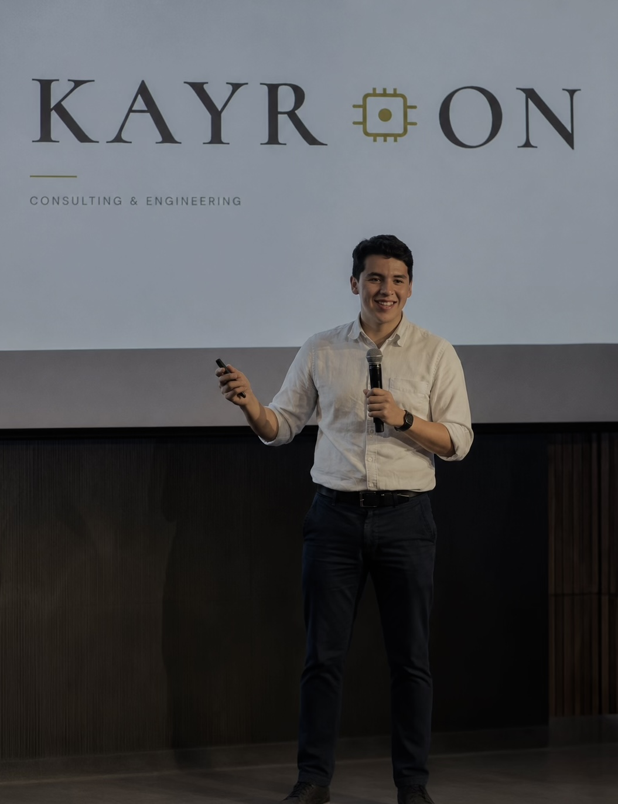

# Brand Book — Kayron Consulting & Engineering

Este documento define las directrices estratégicas, visuales y verbales de **Kayron**, asegurando consistencia en todos los puntos de contacto de la marca. 

---

## 1. Esencia y Estrategia (El alma de la marca)

### Propósito
Democratizar la eficiencia corporativa. Lograr que las empresas en Latinoamérica tengan acceso a los mismos sistemas, automatizaciones y nivel de inteligencia artificial que utilizan las corporaciones de clase mundial.

### El Significado de "Kayron"
* **kayr·on** | del griego. (kairós) el momento exacto / (-on) fuerza que activa.
* **Kairós** era la comprensión griega del tiempo que importa. No el que se mide en relojes, sino el instante preciso en que actuar marca la diferencia entre avanzar o quedarse.
* **-on** es el sufijo de las partículas que mueven el universo (el electrón, el fotón). 
* **El resultado:** No solo es el momento, sino *la fuerza que lo activa*.

### Promesa de Marca (Tagline)
*"Activamos tu momento."*

### Manifiesto
> "Las empresas latinoamericanas merecen acceso a las mismas herramientas que usan las grandes corporaciones del mundo. Esa brecha es nuestra razón de existir. Sin tecnología por moda. Sin diagnósticos guardados en carpetas. Cosas que funcionan, que tu equipo adopta, y que se miden desde el día uno."

### Valores Fundamentales (Cómo pensamos)
1. **Criterio antes que tecnología:** Cada herramienta implementada debe estar justificada por un resultado concreto. La tecnología no se aplica por moda.
2. **Sistemas que viven y crecen:** El trabajo no termina en la entrega. Se construyen sistemas escalables que se miden y evolucionan con la empresa.
3. **Resultados desde el día uno:** Si no se puede medir, no cuenta. Toda acción tiene métricas claras y un punto de comparación real.

---

## 2. Identidad Visual (Las reglas gráficas)

La identidad visual de Kayron se basa en el contraste entre lo clásico/humano (representado por tipografías serif elegantes y colores cálidos) y lo tecnológico/moderno (representado por el chip, las conexiones y las fuentes sans-serif geométricas).

### Todas las Versiones del Logotipo

1. **Logotipo Principal (Wordmark):** 
   - El texto "KAYR" en fuente serif (Cormorant), seguido por la palabra "ON".
   - Integrado de forma fluida con el imagotipo.
   
2. **El Símbolo (El Chip / Activador):**
   - Un ícono lineal geométrico (en color Dorado) que representa un microchip o circuito integrado.
    
   - Cuenta con líneas de conexión y un nodo (círculo) en la parte inferior, que denota activación y flujo de energía.
   
3. **Logotipo Animado (Uso Digital):**
   - En entornos web, el símbolo del chip tiene una animación de caída y rebote (*chip-bounce* / *tumble*), simbolizando la acción de "insertar" la tecnología en el momento exacto.

4. **Isotipo / Favicon:**
   - La versión reducida utiliza únicamente el Símbolo (Chip) o la letra inicial "K" para espacios mínimos (como pestañas de navegadores, `favicon.png`, `icon.svg`).
    

### Paleta de Colores

La paleta se aleja del clásico "azul tecnológico" para posicionarse como una consultora premium, sofisticada y humana, mediante tonos tierra, crema y acentos dorados.

*   **Cream (Fondo Principal):** `#F4F1EB` — Color base que aporta calidez, elegancia y descanso visual, simulando papel premium.
*   **White (Fondo Secundario):** `#FAFAF8` — Utilizado para destacar tarjetas y contenedores de información.
*   **Dark (Texto Principal y Botones):** `#18180F` — Un negro orgánico (casi café muy oscuro) para máxima legibilidad sin la dureza del negro puro.
*   **Mid (Texto de Párrafos):** `#40403A` — Un gris carbón/oliva para jerarquizar bloques de texto y citas.
*   **Light (Etiquetas y Datos Secundarios):** `#8A8679` — Para subtítulos, metadatos y elementos de menor jerarquía.
*   **Gold (Acento y Energía):** `#B89A0A` — El color de la "fuerza que activa". Se usa para resaltar palabras clave en cursiva, enlaces, separadores, íconos de la marca y animaciones de flujo.
*   **Border (Estructura):** `#E2DDD5` — Para líneas divisoras, bordes y cuadrículas sutiles.

### Tipografía

1. **Tipografía Principal (Títulos y Headers):** `Cormorant`
   - *Estilo:* Serif clásico y elegante.
   - *Pesos:* 300, 400, 500, 600.
   - *Uso:* Para títulos grandes (H1, H2) y el wordmark. El uso de la variable *Italic (cursiva)* combinada con el color Gold es fundamental para hacer énfasis en palabras clave (ej. *momento*, *inteligencia artificial*).

2. **Tipografía Secundaria (Cuerpo y Etiquetas):** `DM Sans`
   - *Estilo:* Sans-serif geométrica y limpia.
   - *Pesos:* 200, 300, 400.
   - *Uso:* Párrafos de lectura, botones y descripciones. En su peso ligero (200) y en mayúsculas con espaciado amplio (`letter-spacing: 0.38em`), se utiliza para "eyebrows" (etiquetas superiores) y metadatos.

3. **Tipografía de Acento (Citas y Testimonios):** `Crimson Pro`
   - *Estilo:* Serif (Itálica).
   - *Peso:* 300.
   - *Uso:* Exclusivamente para frases destacadas, testimonios, quotes ("Pull quotes").

### Elementos Gráficos de Apoyo

1. **La Cuadrícula (The Grid):**
   - Una malla o fondo de cuadrícula (`repeating-linear-gradient` y *canvas animado*) que evoca el plano técnico (ingeniería, mapeo de procesos).
2. **Nodos y Conexiones:**
   - Líneas doradas y puntos que se entrelazan y viajan sobre la cuadrícula (representando el flujo de datos y los procesos de automatización).
3. **Separadores Elegantes:**
   - Líneas doradas horizontales y verticales sutiles para delimitar secciones, muchas de ellas animadas como si se estuvieran "dibujando" (`rDraw`).
4. **Fotografía:**
   - Estilo editorial. Desaturada (blanco y negro) al principio que recobra el color en scroll (efecto revelado). Enmarcada en formas de arco invertido o cápsulas que rompen la rigidez del cuadrado puro, aportando una estética premium.
     

---

## 3. Identidad Verbal (Tono y Voz)

El tono de Kayron es el de un **asesor experto, directo y pragmático.** No vende humo, no utiliza jerga tecnológica innecesaria para confundir, sino que busca dar claridad.

*   **Directo y Resolutivo:** Frases cortas y contundentes ("Lo identificamos. Lo resolvemos. Lo medimos.").
*   **Sofisticado pero Accesible:** Habla de Inteligencia Artificial y Automatización no como conceptos inalcanzables, sino como herramientas prácticas. 
*   **Enfocado en el Dolor y la Solución:** Conecta con las frustraciones reales del empresario ("Tu equipo hace en 4 horas lo que podría hacerse en 20 minutos").
*   **Seguro y Confiable:** Evita promesas exageradas. Garantiza medición, acompañamiento y sistemas reales.
*   **Voz Activa:** Utiliza verbos de acción ("Activamos", "Optimizamos", "Mapeamos", "Convertimos").

### Palabras y Conceptos Clave
- *Sí usar:* Automatización, eficiencia, sistemas, momento, adopción, diagnóstico, inteligencia artificial, impacto real, activar, medir.
- *Evitar:* Soluciones mágicas, gurú, disrupción (si es un cliché), "el futuro es hoy" (frases trilladas).

---

## 4. Aplicaciones de la Marca

*   **Sitio Web / UI:** Interfaces limpias basadas en márgenes amplios (breathing room). Botones de alto contraste (Negro a Dorado en hover). Micro-interacciones suaves que simulan tecnología operando de fondo.
*   **Presentaciones Corporativas (Decks):** Deben utilizar fondo `Cream` o `White`, tipografía `Cormorant` para títulos, líneas estructurales `Border` e íconos en `Gold`. Minimalismo ante todo; 1 idea por diapositiva.
*   **Reportes / Entregables de Consultoría:** Deben respirar el valor de "Criterio". Datos duros, ordenados con jerarquía, utilizando las tipografías Serif para introducciones y Sans para la data pura.
*   **Redes Sociales (LinkedIn):** Compartir insights con diseño purista. Quotes en `Crimson Pro Italic` sobre fondo crema. Casos de éxito con números claros.

---
*Este manual es el punto de referencia para mantener la consistencia en el mensaje y la presentación de Kayron, asegurando que la marca siempre se perciba como premium, estratégica y tecnológica.*
